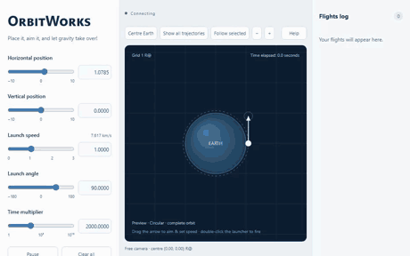

# OrbitWorks

OrbitWorks is an educational computational laboratory for classical orbital
mechanics. It keeps the governing equations visible and makes analytical
solutions, numerical trajectories, conservation laws, and orbital geometry
easy to compare, following a progression from Newtonian gravity through
circular motion, energy and angular momentum, conic sections, orbital
elements, and time-dependent motion.

## What's implemented

- An interactive app: place a launcher around Earth, aim and set its speed,
  and fire independent projectiles to see circles, ellipses, parabolas,
  hyperbolas, and radial trajectories emerge from different initial
  conditions, including impacts.
- A shared `orbitworks` package with tested core functions for classifying a
  Cartesian state into orbital elements, sampling conic-section geometry, and
  numerically propagating the two-body equations of motion, complete with
  conservation-error diagnostics. The app and the example scripts both build
  on this same code.
- Runnable examples (`examples/`) demonstrating conic-section classification
  and numerical orbit propagation compared against the exact analytic
  solution.
- A theory guide developing the underlying mathematics chapter by chapter,
  from Newton's law to the time-dependent trajectory.

## Documentation and live app

- **Documentation:** <https://roberagro.github.io/orbitworks/>
- **Live app:** <https://orbitworks-xxh2.onrender.com/>

## Installation

OrbitWorks requires Python 3.11 through 3.14 and uses
[Poetry](https://python-poetry.org/) for dependency and package management.

Clone the repository and let Poetry create the environment and install the
project dependencies:

```bash
git clone https://github.com/RoberAgro/orbitworks.git
cd orbitworks
poetry install
```

Verify that the package can be imported from the Poetry environment:

```bash
poetry run python -c "import orbitworks"
```

## Quick start

Launch the app locally and open it in your default browser:

```bash
poetry run python examples/launch_app.py
```

The app runs at **http://127.0.0.1:8054**; stop it with Ctrl+C. Place the
launcher, aim and set its speed, then fire: existing projectiles keep moving
while a new one is computed, so you can quickly compare several trajectories
side by side.



## License

OrbitWorks is available under the [MIT License](LICENSE.md).
