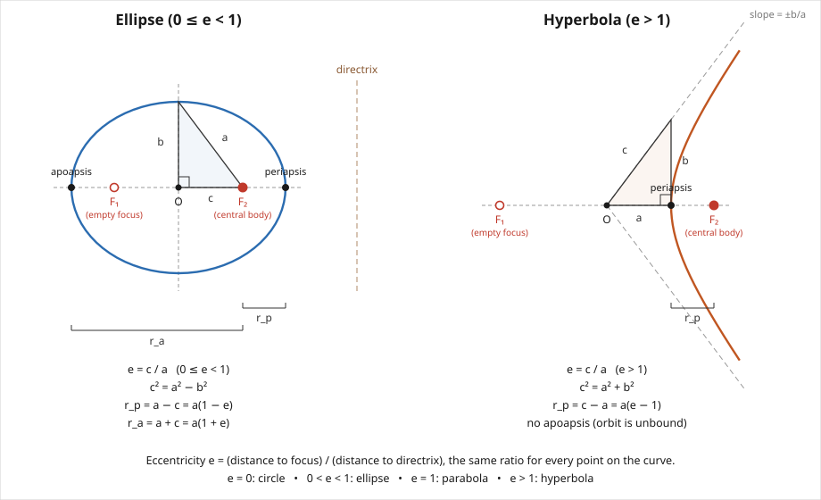

# The geometry of conic orbits: a reference atlas

An ellipse and a hyperbola are, first of all, curves with their own classical
geometric definitions, independent of any orbital mechanics: built from a
center, two foci, and a focal distance $c$. This chapter builds that picture,
ties it to the eccentricity and semi-latus rectum already in hand, and then
collects every quantity attached to a Keplerian orbit — $p$, $e$, $a$, $b$,
$c$, $r_p$, $r_a$, $\boldsymbol\ell$, $\varepsilon$ — into one map, so that
any one known quantity converts directly to any other.

## The ellipse and hyperbola as curves

The ellipse's Cartesian form and its constants $a$, $b$, $c=ae$ follow by
converting the polar solution $r=p/(1+e\cos\theta)$ (chapter 5). There is
also a classical, purely geometric definition of these curves, independent of
any orbital mechanics, that makes the term *eccentricity* intuitive.

**The ellipse** is the locus of points whose *sum* of distances to two fixed
foci, a distance $c$ apart from the center, is constant, equal to $2a$. Apply
this to the point directly above the center, at $(0,b)$: by symmetry it is
equidistant from both foci, so each distance equals $a$. The right triangle
formed by the center, a focus, and that point then gives, by the Pythagorean
theorem,

$$
\boxed{
c^2=a^2-b^2,
}
$$

consistent with $b=a\sqrt{1-e^2}$ and $c=ae$ (chapter 5):
$c^2=a^2e^2=a^2(1-b^2/a^2)=a^2-b^2$.

**The hyperbola** is the locus where the *difference* of distances to the two
foci is constant, equal to $2a$. The analogous right triangle — center,
focus, and the point where the asymptote passes over the vertex — gives

$$
\boxed{
c^2=a^2+b^2,
}
$$

where $b$ now sets the asymptote slope $b/a$ rather than a physical
half-width.

**Eccentricity as $c/a$.** For both curves,

$$
\boxed{
e=\frac{c}{a}.
}
$$

This is equivalent to the focus-directrix ratio used to define $e$ in chapter
5: $c<a$ for an ellipse gives $0\le e<1$, and $c>a$ for a hyperbola gives
$e>1$. The parabola, with no center and no second focus at finite distance,
is the boundary case $e=1$, reachable only through the focus-directrix
definition.

Only one focus is physical — it is where the central mass sits. The
periapsis and apoapsis, $r_p=a(1-e)$ and $r_a=a(1+e)$ (chapter 5), are simply
the distances from that focus to the near and far vertices, $a-c$ and $a+c$:
a hyperbola's near branch has $r_p=c-a=a(e-1)$ and no apoapsis, since the far
branch recedes to infinity along the asymptote.

## Glossary

$$
\boxed{
\begin{array}{c|l|l}
\text{Symbol} & \text{Name} & \text{Meaning} \\
\hline
e & \text{eccentricity} & c/a;\ \text{shape of the conic: how elongated it is} \\
a & \text{semi-major/transverse axis} & \text{half the curve's own axis length, measured from its center} \\
b & \text{semi-minor/conjugate axis} & \text{ellipse: half-width; hyperbola: sets asymptote slope } b/a \\
c & \text{focal distance} & \text{distance from the center to either focus} \\
p & \text{semi-latus rectum} & \text{half the chord through the focus, perpendicular to the major axis} \\
r_p & \text{periapsis distance} & \text{closest distance from the occupied focus (central body) to the orbit} \\
r_a & \text{apoapsis distance} & \text{farthest distance from the occupied focus to the orbit (ellipse only)} \\
\boldsymbol\ell & \text{specific angular momentum} & \mathbf r\times\mathbf v,\ \text{conserved} \\
\varepsilon & \text{specific mechanical energy} & v^2/2-GM/r,\ \text{conserved} \\
v_c & \text{circular speed} & \text{speed of a circular orbit at a given radius}, \sqrt{GM/r}
\end{array}
}
$$

$a$ and $b$ describe the curve's own size and shape, measured from its
center; $r_p$ and $r_a$ describe distances measured from the occupied focus.
The two are related, but not equal, as derived above.

## The parameter web

Every quantity in the glossary is fixed by any **two** independent numbers —
the Binet-equation solution (chapter 5) has exactly two free constants beyond
orientation ($\ell$ and $C$, repackaged as $p$ and $e$). The table below
collects the conversions already derived, and where each comes from.

$$
\boxed{
\begin{array}{c|c|c}
\text{Pair} & \text{Converts to } (a,e) \text{ via} & \text{Derived in} \\
\hline
(a,e) & \text{--} & \text{chapter 5} \\
(r_p,r_a) & a=\dfrac{r_p+r_a}{2},\quad e=\dfrac{r_a-r_p}{r_a+r_p} & \text{chapter 5 (}r_p=a(1-e),\ r_a=a(1+e)\text{)} \\
(p,e) & a=\dfrac{p}{1-e^2} & \text{chapter 5} \\
(\boldsymbol\ell,\mathbf e) & p=\dfrac{\ell^2}{GM},\quad e=|\mathbf e| & \text{chapter 6 (eccentricity vector)} \\
(\varepsilon,\ell) & a=-\dfrac{GM}{2\varepsilon},\quad e^2=1+\dfrac{2\varepsilon\ell^2}{(GM)^2} & \text{chapter 7}
\end{array}
}
$$

The $(r_p,r_a)$ conversion follows by adding and subtracting chapter 5's two
boxed relations. Every other quantity — $p$, $b$, $c$, $\varepsilon$ — follows
from any row using the relations already derived in chapters 5–7. In
particular, $(\boldsymbol\ell,\mathbf e)$ and $(\varepsilon,\ell)$ are the two
pairs most directly tied to an initial Cartesian state $(\mathbf r_0,\mathbf
v_0)$: one computes the first pair from it immediately (chapter 6), the
second from energy and angular momentum alone (chapter 7), and both must
yield the same $e$.

## How many numbers specify a full orbital state?

The pairs above fix only the orbit's **shape and size**. Locating a body in
three-dimensional space at a specific instant needs more:

$$
\boxed{
\begin{array}{c|c|l}
\text{Count} & \text{Parameters} & \text{Role} \\
\hline
2 & (a,e)\ \text{or equivalent} & \text{shape and size} \\
2 & (i,\Omega) & \text{orientation of the orbital plane in space} \\
1 & \omega & \text{orientation of periapsis within that plane} \\
1 & \theta_0\ \text{or}\ M_0\ \text{(at a reference epoch }t_0\text{)} & \text{position of the body along the orbit}
\end{array}
}
$$

This totals **six** independent numbers, matching the six classical Keplerian
orbital elements $(a,e,i,\Omega,\omega,M_0)$ and the six components of an
initial Cartesian state $(\mathbf r_0,\mathbf v_0)$. The two representations
are two different bases for the same six-dimensional space of possible
two-body states.

With the orbit's geometry now fully characterized — from any starting
description — the remaining question is how the body moves along it as a
function of time, taken up next.
